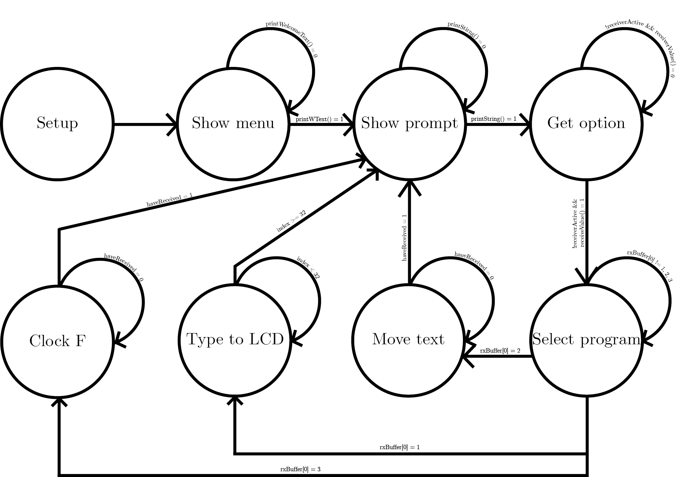

# STM32H7-LCD-1602A
Functions that enable the LCD 1602A to work with STM32H7

<h3>
  LCD Functions:
</h3>

  <ul>
    <li>
      LCD_Init(bool, bool) initializes the LCD. Takes two parameters that setup the cursor.
    </li>
    <li>
      LCD_Write(char *) takes a string that will be written to the LCD.
    </li>
    <li>
      LCD_Write_Char(char) takes a single character that will be written to the LCD.
    </li>
    <li>
      LCD_Pos_Cursor(uint8_t, uint8_t) takes row and column. Sets the cursor position accordingly.
    </li>
    <li>
      LCD_Clear(void) clears the screen and resets cursor position.
    </li>
    <li>
      LCD_Scroll_Display_Right(void) scrolls contents for one position to the right.
    </li>
    <li>
      LCD_Scroll_Display_Left(void) scrolls contents for one position to the left.
    </li>
  </ul>

<h3>
  Connections
</h3>

  <ul>
    <li>
      RS to PB7 (H7)
    </li>
    <li>
      E to PB6 (H7)
    </li>
    <li>
      DB4 to PG3 (H7)
    </li>
    <li>
      DB5 to PA6 (H7)
    </li>
    <li>
      DB6 to PK1 (H7)
    </li>
    <li>
      DB7 to PA8 (H7)
    </li>
  </ul>

<h3>
  LCD.c and LCD.h
</h3>

  In LCD.h, there are definitions for connections that are used on H7, commands, and function prototypes.
  LCD.c has implementations for those functions.
  Communication with the LCD uses 4 bits. If you want to use 8 bits, __LCD_Send(), __LCD_Write4Bits(), and definitions for connections must be changed.
  If you wish to use other connections on H7, you have to change the definitions for connections in LCD.h accordingly.

<h3>
  Demo programs
</h3>

  In main.c, there is a program that demonstrates LCD functions. To use this program, you will need a terminal (e.g., Putty) with the following settings:
  <ul>
    <li>
      Boud rate: 9600
    </li>
    <li>
      Data bits: 8
    </li>
    <li>
      Parity: None
    </li>
    <li>
      Stop bits: 1
    </li>
  </ul>
  The program itself is implemented using a finite state machine (FSM).
  

<h3>
  Notes
</h3>

  If the LCD does not initialize, you can try to increase the delay in LCD_Init(). The same applies 
  to other functions that use a delay.

